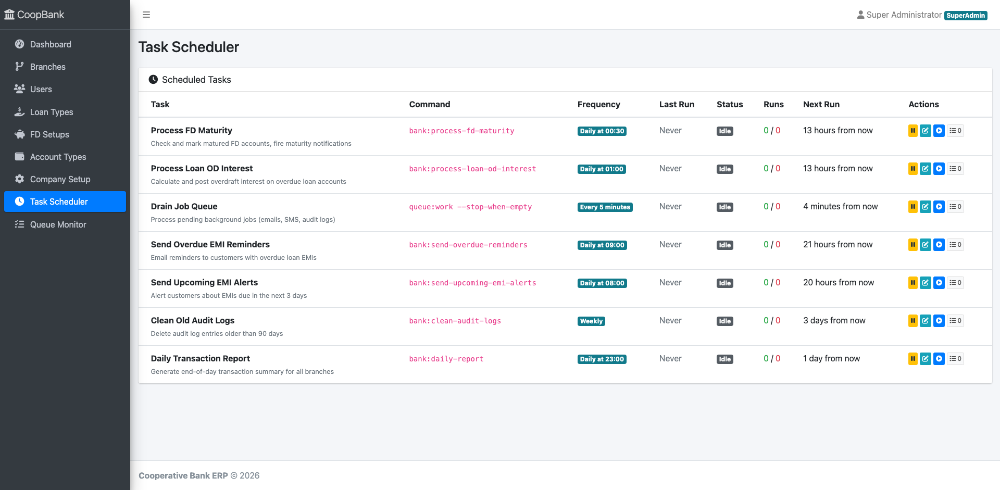
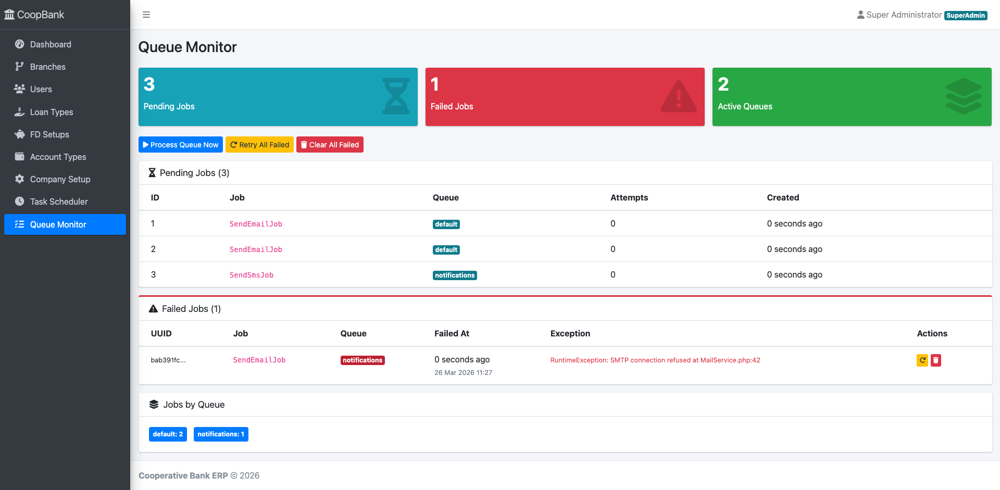

# Cooperative Bank Management System

[](https://github.com/vipul26singh/laravel-cooperative-bank/actions/workflows/tests.yml)

A production-ready, open-source **core banking solution** purpose-built for cooperative banks, credit societies, and microfinance institutions. Manages the complete banking lifecycle — from customer onboarding and KYC verification through loan disbursement, EMI collection, fixed deposits, and financial reporting — all from a single web application.

Built with **Laravel 13** and deployable in one command via Docker. No banking software license fees. No vendor lock-in.


---

## Why This Exists

Most cooperative banks in India still run on legacy desktop software or expensive licensed ERP systems. This project provides a **modern, web-based alternative** that any cooperative bank can self-host, customize, and extend — with proper role-based access, audit trails, and event-driven architecture built in from day one.

---

## Table of Contents

- [Features](#features)
- [Screenshots](#screenshots)
- [Tech Stack](#tech-stack)
- [System Requirements](#system-requirements)
- [Quick Start](#quick-start)
- [Web Installer](#web-installer)
- [Docker (Standalone)](#docker-standalone)
- [User Roles](#user-roles)
- [Architecture Overview](#architecture-overview)
- [API Reference](#api-reference)
- [Scheduled Tasks](#scheduled-tasks)
- [Testing](#testing)
- [Roadmap](#roadmap)
- [Contributing](#contributing)
- [License](#license)

---

## Features

### Customer Lifecycle

- **Customer Registration** — Clerk captures full personal details, address, nominee, and occupation info
- **KYC Verification** — PAN and Aadhaar document upload with photo and ID proof storage
- **Approval Workflow** — Clerk registers, Manager reviews and approves/rejects with remarks
- **Member Activation** — Approved customers become active members with share accounts

### Banking Operations

- **Bank Accounts** — Savings, Current, and Overdraft (OD) account types with auto-generated account numbers
- **Deposits & Withdrawals** — Cash and cheque transactions with real-time balance updates and insufficient-balance protection
- **Fixed Deposits** — FD account creation with scheme-based interest rates, maturity tracking, and auto-processing via scheduled jobs
- **Loan Management** — Full lifecycle: application, approval, disbursement, EMI schedule generation (daily/weekly/monthly), repayment recording, and auto-closure on final payment
- **Gold Loans** — Dedicated gold loan product with valuation support
- **Share Accounts** — Member share capital management and transactions

### Administration

- **5 User Roles** — SuperAdmin, Manager, Clerk, Cashier, Accountant — each with dedicated dashboards and scoped access
- **Multi-Branch Architecture** — Every query is scoped to the user's branch; branch context middleware ensures data isolation
- **Configurable Products** — SuperAdmin defines loan types, FD schemes, account types, interest rates, and membership fees
- **Company Setup** — Bank name, address, GST/PAN, logo — appears on receipts and reports

### Reporting & Compliance

- **Loan Outstanding Report** — All active loans with principal, outstanding balance, and overdue status
- **Transaction Statement** — Full debit/credit history for any account over a date range
- **Loan Demand Collection Sheet** — EMI schedule vs actual collections for monitoring and follow-up
- **Audit Trail** — Every sensitive action (approval, transaction, disbursement) is logged with user, branch, IP, and timestamp via event-driven listeners

### Operations & Monitoring

- **Task Scheduler UI** — View, enable/disable, edit schedule, run manually, and monitor all 7 scheduled tasks from the browser. No crontab editing needed.
- **Queue Monitor** — Real-time dashboard for pending and failed background jobs. Retry, delete, or flush failed jobs. Process the entire queue with one click.
- **Schedulable Jobs** — Overdue EMI reminders, upcoming EMI alerts, audit log cleanup, daily transaction reports — all configurable from the admin panel

### Technical

- **Event-Driven Architecture** — 11 domain events with queued listeners for notifications, audit logging, and schedule generation
- **REST API** — Full Sanctum-authenticated API for mobile/SPA clients (customers, accounts, transactions, loans, FDs)
- **Docker Standalone** — One-command deployment with Nginx, PHP-FPM, queue worker, and scheduler bundled in a single container
- **Web Installer** — 5-step browser-based setup wizard with requirements check, DB auto-creation, and admin account setup
- **201 Automated Tests** — 195 PHPUnit tests + 6 Dusk browser tests with 80+ auto-generated screenshots

---

## Screenshots

> All screenshots are auto-generated by the browser test suite (`php artisan dusk`).

### Login


### SuperAdmin Dashboard


### Branch Management


### User Management


### Loan Type Configuration


### Company Setup


### Manager Dashboard


### Customer Approval


### Customer Registration (Clerk)


### Loan Application (Clerk)


### Bank Transaction (Cashier)


### Loan Outstanding Report (Accountant)


### Task Scheduler (SuperAdmin)



### Queue Monitor (SuperAdmin)



<details>
<summary>View all 80+ screenshots organized by role</summary>

Run `php artisan dusk` to regenerate. Screenshots are saved to:

```
tests/Browser/screenshots/
├── 01-auth/          # Login, logout flow
├── 02-superadmin/    # All CRUD: branches, users, loan types, FD, accounts, company
├── 03-manager/       # Customers, bank accounts, FDs, loans, applications
├── 04-clerk/         # Customer registration, loan applications
├── 05-cashier/       # Transactions, loan repayments
└── 06-accountant/    # Reports: outstanding, statement, demand
```

</details>

---

## Tech Stack

| Layer | Technology |
|---|---|
| Backend | PHP 8.4+, Laravel 13 |
| Database | SQLite (dev) / MySQL or PostgreSQL (prod) |
| Authentication | Laravel Sanctum |
| Queue | Database queue driver |
| Frontend | Blade + AdminLTE 3, Tailwind CSS 4, Vite 8 |
| API Client (JS) | Axios |
| Testing | PHPUnit 12 |
| Code Style | Laravel Pint |
| Containerization | Docker + Docker Compose |

---

## System Requirements

- PHP >= 8.4
- Composer >= 2.x
- Node.js >= 20.x & npm >= 10.x
- SQLite 3 (dev) or MySQL 8+ / PostgreSQL 14+ (prod)

---

## Quick Start

```bash
# 1. Clone the repository
git clone https://github.com/vipul26singh/laravel-cooperative-bank.git
cd laravel-cooperative-bank

# 2. Install PHP dependencies
composer install

# 3. Install Node dependencies
npm install

# 4. Copy environment file
cp .env.example .env

# 5. Generate application key
php artisan key:generate

# 6. Run migrations and seed initial data
php artisan migrate --seed

# 7. Build frontend assets
npm run build

# 8. Start the development server
php artisan serve
```

The app will be available at `http://localhost:8000`.

**Default admin credentials:**
- Email: `admin@coopbank.com`
- Password: `Admin@123`

### Development Mode (all services at once)

```bash
npm run dev
```

This concurrently starts the PHP dev server, queue worker, log watcher, and Vite hot-reload server.

---

## Web Installer

Prefer a GUI over the command line? The built-in **web-based installation wizard** handles the database setup, migrations, and admin user creation through your browser — no artisan commands needed.

### Option A: Docker (Easiest — nothing to install)

```bash
docker compose up -d
# Open http://localhost:8000/install
```

### Option B: Manual (requires PHP + Composer on your machine)

```bash
git clone https://github.com/vipul26singh/laravel-cooperative-bank.git
cd laravel-cooperative-bank
composer install        # Required — Laravel needs vendor/ to boot
php artisan serve       # Start the server
# Open http://localhost:8000/install
```

> `npm install` and `npm run build` are **not required** — all CSS/JS comes from CDN. Only run them if you want to customize frontend assets.

### Wizard Steps

| Step | What it does |
|---|---|
| **1. Welcome** | Overview of what's needed |
| **2. Requirements** | Checks PHP version, extensions, writable directories |
| **3. Database** | Configure SQLite (zero-config), MySQL, or PostgreSQL — live connection test |
| **4. Admin Setup** | Set app name, URL, and create the SuperAdmin account |
| **5. Install** | Review settings → creates `.env`, runs migrations, seeds roles and data |

After installation, the wizard auto-disables itself (creates `storage/installed` marker). Visiting `/install` again redirects to the home page.

---

## Docker (Standalone)

Run the entire application as a self-contained Docker container — no PHP, Composer, or Node.js required on the host.

### Prerequisites

- [Docker](https://docs.docker.com/get-docker/) >= 20.10
- [Docker Compose](https://docs.docker.com/compose/install/) >= 2.x

### One-Command Start

```bash
docker compose up -d
```

The app will be available at `http://localhost:8000`.

On first launch the container automatically:
1. Generates an application key
2. Creates the SQLite database
3. Runs all migrations
4. Seeds default data (roles, admin user, etc.)

**Default admin credentials:**
- Email: `admin@coopbank.com`
- Password: `Admin@123`

### Common Operations

```bash
# View logs
docker compose logs -f app

# Stop the app
docker compose down

# Stop and remove all data (database + uploads)
docker compose down -v

# Rebuild after code changes
docker compose up -d --build

# Run artisan commands inside the container
docker compose exec app php artisan tinker
docker compose exec app php artisan migrate:status

# Access a shell inside the container
docker compose exec app sh
```

### Configuration

Override settings via environment variables in `docker-compose.yml` or a `.env` file:

| Variable | Default | Description |
|---|---|---|
| `APP_PORT` | `8000` | Host port to expose |
| `APP_ENV` | `production` | Application environment |
| `APP_DEBUG` | `false` | Debug mode |
| `APP_URL` | `http://localhost:8000` | Application URL |
| `MAIL_MAILER` | `log` | Mail driver (`log`, `smtp`) |
| `MAIL_HOST` | — | SMTP host |
| `MAIL_PORT` | — | SMTP port |
| `MAIL_USERNAME` | — | SMTP username |
| `MAIL_PASSWORD` | — | SMTP password |

### Data Persistence

Two named Docker volumes are used:
- `db_data` — SQLite database file
- `storage_data` — uploaded files (KYC documents, etc.)

Data survives container restarts and rebuilds. To fully reset, run `docker compose down -v`.

### Architecture

The container bundles everything in a single image:
- **Nginx** — web server on port 80
- **PHP-FPM 8.4** — application runtime
- **Supervisor** — manages Nginx, PHP-FPM, queue worker, and scheduler
- **SQLite** — embedded database (no external DB needed)

```
┌──────────────────────────────────────────┐
│            Docker Container              │
│                                          │
│   Nginx :80  ──►  PHP-FPM 8.4 :9000     │
│                                          │
│   Supervisor                             │
│   ├── php-fpm                            │
│   ├── nginx                              │
│   ├── queue:work (background jobs)       │
│   └── schedule:run (cron loop)           │
│                                          │
│   SQLite (database/database.sqlite)      │
└──────────────────────────────────────────┘
```

---

## User Roles

| Role | Access Level | Primary Responsibilities |
|---|---|---|
| **SuperAdmin** | Full system | Branches, users, loan types, FD setup, account types, company config |
| **Manager** | Branch-level | Approve customers/loans, open accounts, oversee operations |
| **Clerk** | Data entry | Register customers, submit loan applications |
| **Cashier** | Transactions | Process deposits, withdrawals, loan repayments |
| **Accountant** | Read + reports | View reports, loan outstanding, transaction statements |

---

## Architecture Overview

```
app/
├── Console/Commands/       # Scheduled CLI commands
├── Events/                 # Domain events (11 events)
├── Http/
│   ├── Controllers/
│   │   ├── Api/            # REST API controllers
│   │   ├── SuperAdmin/     # SuperAdmin web controllers
│   │   ├── Manager/        # Manager web controllers
│   │   ├── Clerk/          # Clerk web controllers
│   │   ├── Cashier/        # Cashier web controllers
│   │   └── Accountant/     # Accountant web controllers
│   ├── Middleware/         # RoleMiddleware, SetBranchContext
│   └── Requests/           # Form request validation (7 classes)
├── Jobs/                   # Queued jobs (FD maturity, OD interest, email, SMS)
├── Listeners/              # Event listeners (8 listeners)
├── Models/                 # Eloquent models (28 models)
├── Providers/              # AppServiceProvider, EventServiceProvider
└── Services/               # Business logic layer (5 services)
```

### Event Flow

```
User Action
    └─► Controller
            └─► Service (business logic)
                    └─► Event fired
                            ├─► Listener 1 (e.g. GenerateLoanInstallmentSchedule)
                            ├─► Listener 2 (e.g. SendLoanApprovalNotification)
                            └─► Listener 3 (e.g. LogAuditTrail)
                                        └─► Job dispatched (SendEmailJob / SendSmsJob)
```

---

## API Reference

Base URL: `/api`
Authentication: Bearer token (Laravel Sanctum)

### Auth

| Method | Endpoint | Description |
|---|---|---|
| POST | `/api/login` | Login, returns token |
| POST | `/api/logout` | Revoke token |
| GET | `/api/me` | Current user info |

### Customers

| Method | Endpoint | Description |
|---|---|---|
| GET | `/api/customers` | List customers |
| POST | `/api/customers` | Register customer |
| GET | `/api/customers/{id}` | Get customer |
| PUT | `/api/customers/{id}` | Update customer |
| DELETE | `/api/customers/{id}` | Delete customer |
| POST | `/api/customers/{id}/approve` | Approve customer |
| POST | `/api/customers/{id}/reject` | Reject customer |

### Bank Accounts

| Method | Endpoint | Description |
|---|---|---|
| GET | `/api/bank-accounts` | List accounts |
| POST | `/api/bank-accounts` | Open account |
| GET | `/api/bank-accounts/{id}` | Get account |
| GET | `/api/bank-accounts/search/{accountNumber}` | Search by account number |

### Transactions

| Method | Endpoint | Description |
|---|---|---|
| GET | `/api/transactions` | List transactions |
| POST | `/api/transactions` | Create transaction |
| GET | `/api/transactions/{id}` | Get transaction |

### Loans

| Method | Endpoint | Description |
|---|---|---|
| GET | `/api/loans` | List loans |
| POST | `/api/loans` | Disburse loan |
| GET | `/api/loans/{id}` | Get loan |
| GET | `/api/loans/{id}/schedule` | Installment schedule |
| POST | `/api/loans/{id}/repayment` | Record repayment |

### FD Accounts

| Method | Endpoint | Description |
|---|---|---|
| GET | `/api/fd-accounts` | List FDs |
| POST | `/api/fd-accounts` | Open FD |
| GET | `/api/fd-accounts/{id}` | Get FD |

---

## Scheduled Tasks

Managed via `routes/console.php`:

| Command | Schedule | Description |
|---|---|---|
| `app:process-fd-maturity` | Daily 00:00 | Checks and processes matured FD accounts |
| `app:process-loan-od-interest` | Daily 00:01 | Posts overdraft interest to OD accounts |
| `queue:work --stop-when-empty` | Every minute | Drains the job queue |

Start the scheduler in production:

```bash
* * * * * cd /path/to/laravel-cooperative-bank && php artisan schedule:run >> /dev/null 2>&1
```

---

## Testing

Two test suites cover the entire application — **PHPUnit** for fast backend logic and **Laravel Dusk** for real browser-based UI testing with screenshots.

### Unit & Feature Tests (PHPUnit)

157 tests covering authentication, role-based access, CRUD, business workflows, input validation, and all REST API endpoints. Runs in ~4 seconds with SQLite in-memory.

```bash
php artisan test                          # run all
php artisan test --filter=Api             # API tests only
php artisan test --filter=CustomerApprovalTest   # run one file
php artisan test --coverage               # with coverage (needs Xdebug/PCOV)
docker compose exec app php artisan test  # inside Docker
```

```
tests/Feature/
├── Auth/LoginTest.php                  # Login, logout, redirects, validation
├── RoleAccess/RoleAccessTest.php       # All 5 roles × all route groups
├── SuperAdmin/                         # Branch, User, LoanType, FdSetup, AccountType, CompanySetup CRUD
├── Manager/                            # Customer approval/reject, dashboard, workflow
├── Clerk/                              # Customer registration, loan application
├── Cashier/                            # Deposit, withdraw, validation
├── Accountant/                         # Dashboard, role enforcement
└── Api/                                # REST API tests (Sanctum token auth)
    ├── AuthApiTest.php                 # Login, logout, token lifecycle
    ├── CustomerApiTest.php             # CRUD, approve, reject, filter
    ├── BankAccountApiTest.php          # Open, list, search, close
    ├── TransactionApiTest.php          # Deposit, withdraw, validation, cheque
    ├── LoanApiTest.php                 # Disburse, schedule, repayment
    ├── FdAccountApiTest.php            # Open FD, list, validate
    └── DashboardApiTest.php            # Stats structure and counts
```

### Browser Tests (Laravel Dusk)

6 end-to-end flow tests running **headless Chrome** via ChromeDriver. Each test logs in as one role, visits every page, takes screenshots, and logs out before the next role starts. Produces **68 screenshots** organized by role.

#### Prerequisites

- **Google Chrome** installed on the host machine
- ChromeDriver is auto-managed by Dusk (downloaded on `dusk:install`)
- No manual server startup needed — the test suite auto-starts a PHP dev server

#### Running Browser Tests

```bash
# First-time setup (already done if you cloned this repo)
php artisan dusk:install

# Run all browser tests (headless)
php artisan dusk

# Watch tests run in a visible Chrome window
php artisan dusk --browse

# Run a specific role's flow
php artisan dusk --filter=T02_SuperAdminFlow
php artisan dusk --filter=T05_CashierFlow

# Run inside Docker (requires Chrome in container — not included by default)
# For CI, use the host machine or a Selenium container
```

> **Note:** Dusk swaps `.env` with `.env.dusk.local` during the run and restores it after. The test uses a separate `database/dusk.sqlite` database so your dev data is never touched.

```
tests/Browser/
├── T01_LoginFlowTest.php        # Login page, invalid creds, login, logout
├── T02_SuperAdminFlowTest.php   # All CRUD: branches, users, loan types, FD, accounts, company
├── T03_ManagerFlowTest.php      # Dashboard, customers, bank accounts, FDs, loans, applications
├── T04_ClerkFlowTest.php        # Dashboard, customer list/create, loan applications
├── T05_CashierFlowTest.php      # Dashboard, transactions, loan repayments
└── T06_AccountantFlowTest.php   # Dashboard, all 3 reports

tests/Browser/screenshots/       # Auto-generated, organized by role
├── 01-auth/                     # 6 screenshots
├── 02-superadmin/               # 33 screenshots
├── 03-manager/                  # 10 screenshots
├── 04-clerk/                    # 6 screenshots
├── 05-cashier/                  # 6 screenshots
└── 06-accountant/               # 5 screenshots
```

### Test Summary

| Suite | Tests | Assertions | Duration |
|---|---|---|---|
| PHPUnit — Web (Feature + Unit) | 147 | 385 | ~6s |
| PHPUnit — API (Sanctum) | 48 | 162 | ~1s |
| Dusk — Browser (headless Chrome) | 6 | 82 | ~155s |
| **Total** | **201** | **629** | — |

---

## Roadmap

Planned improvements to make the system production-ready for real bank operations. Contributions welcome — pick any item and open a PR.

### UX & Forms
- [x] **Searchable dropdowns** (Select2 / Tom Select) for customer and account lookups — critical for clerks processing 100+ customers/day
- [x] **Client-side validation** with real-time inline feedback on all forms
- [x] **Confirmation modals** before destructive actions (approve, reject, deactivate, delete)
- [x] **Field help text and format hints** on forms (e.g., branch code format, PAN pattern)
- [x] **Pagination styling** — publish Laravel paginator views for AdminLTE theme

### Printing & Export
- [x] **Print-friendly transaction receipts** — clean, styled print layout for every deposit, withdrawal, and repayment
- [x] **CSV export** on all accountant reports (loan outstanding, transaction statement, demand sheet)
- [ ] **Account statement PDF** generation for customers

### Search & Filtering
- [x] **Search bar** — search customers, accounts, loans by name, number, or mobile across the app
- [ ] **Advanced filters** on all index pages — date range, status, branch, loan type
- [ ] **Transaction history search** with date range and account number filtering on cashier pages

### Authentication & Security
- [x] **Password change** page for logged-in users
- [x] **Forgot password** flow with email-based reset tokens
- [ ] **Two-factor authentication (2FA)** via OTP for sensitive operations
- [ ] **Session timeout warning** with auto-logout countdown
- [ ] **Login audit log** — track login attempts, IPs, and devices

### Banking Features
- [x] **Bulk customer approval** — approve/reject multiple pending customers at once
- [ ] **Interest posting** — automated monthly/quarterly interest credit to savings accounts
- [ ] **Account statement generation** — downloadable PDF statements for any date range
- [ ] **Cheque book management** — issue, track, and stop-payment for cheque books
- [ ] **Inter-branch transfers** — transfer funds between accounts across branches
- [ ] **Standing instructions** — recurring automated transfers and payments
- [ ] **NPA classification** — auto-flag overdue loans as NPA based on RBI norms

### Reports & Analytics
- [ ] **Dashboard charts** — visual graphs for deposit trends, loan portfolio, branch performance
- [ ] **Day book / cash book** — daily summary of all cash transactions per branch
- [ ] **Trial balance & P&L** — basic accounting reports
- [ ] **Overdue loan alerts** — email/SMS notifications for upcoming and overdue EMIs
- [ ] **Branch comparison report** — compare performance metrics across branches

### Customer Portal (Self-Service) — [Architecture Doc](CUSTOMER_PORTAL_ARCHITECTURE.md)
- [ ] **Customer login** — separate auth for customers using mobile + password / OTP
- [ ] **Account dashboard** — view savings account balances, recent transactions
- [ ] **Loan details** — active loans, EMI schedule, outstanding balance, repayment history
- [ ] **FD overview** — FD accounts with maturity dates and interest earned
- [ ] **Account statement download** — PDF statement for any date range
- [ ] **Profile management** — update contact info, nominee details

### Payment Gateway & Payouts (Phase 2) — [Architecture Doc](CUSTOMER_PORTAL_ARCHITECTURE.md#phase-2--payment-gateway-integration)
- [ ] **Online EMI payment** — pay loan EMI via Razorpay / Paytm / UPI
- [ ] **Online FD opening** — open fixed deposits via online payment
- [ ] **Online deposit** — add funds to savings account via PG
- [ ] **Payout integration** — automated FD maturity payout and loan disbursement to bank account
- [ ] **Payment history** — track all online payments with gateway reference IDs
- [ ] **Webhook handlers** — auto-confirm payments and record transactions on gateway callback

### Technical
- [ ] **Model factories** for all models — enable faster test writing
- [ ] **Notification channels** — implement real SMS/email drivers (currently log-only)
- [ ] **API rate limiting** and request throttling
- [ ] **Webhook support** for third-party integrations
- [x] **Mobile-responsive testing** — verify all pages work on tablets (common in bank branches)
- [x] **Accessibility audit** — ARIA labels, keyboard navigation, screen reader support
- [x] **CI/CD pipeline** — GitHub Actions for automated testing on every push

---

## Contributing

See [CONTRIBUTING.md](CONTRIBUTING.md) for guidelines on how to contribute.

---

## License

This project is open-sourced software licensed under the [MIT license](https://opensource.org/licenses/MIT).
