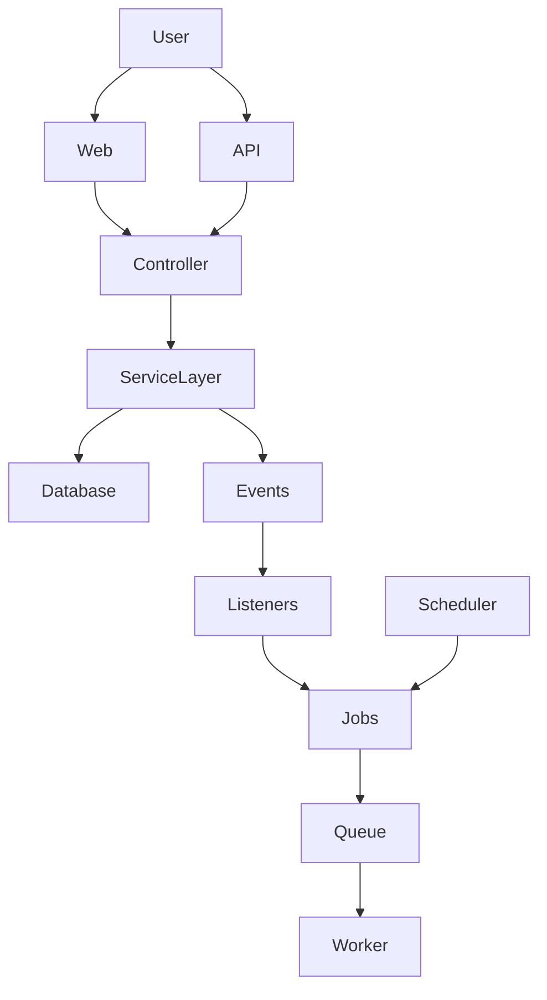
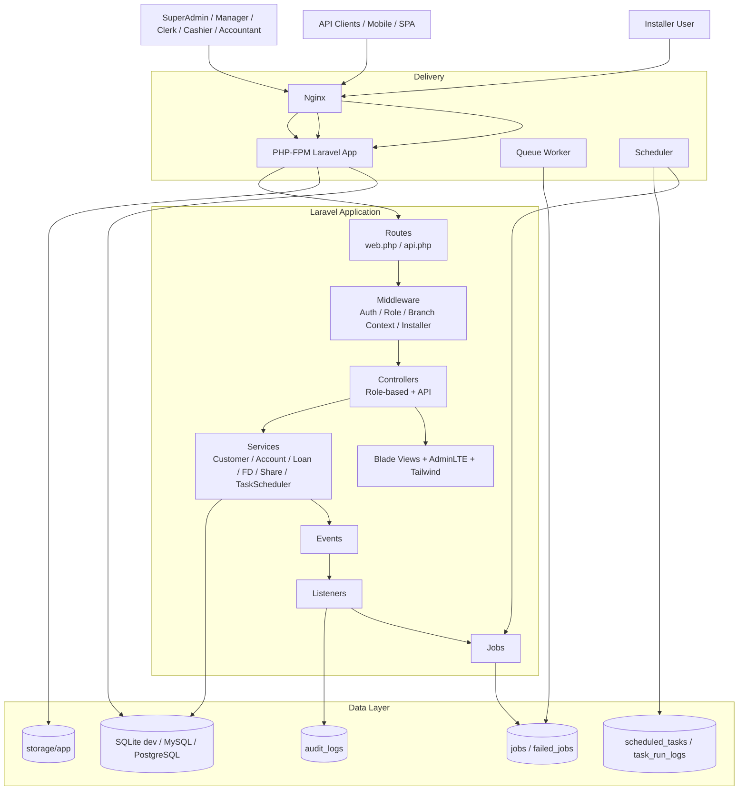
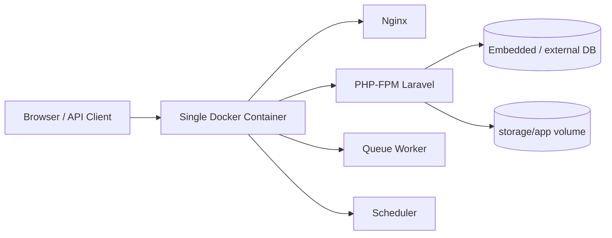

# Core Banking Platform

A modern, production-ready core banking system designed for cooperative banks, credit societies, and microfinance institutions.

---

## 🚀 Overview

Most cooperative institutions still rely on outdated desktop software or fragmented tools.

This platform provides a **web-based, scalable alternative** built with modern architecture, enabling institutions to manage their complete banking lifecycle efficiently.

It is designed as a **modular Laravel monolith with event-driven workflows**, ensuring both simplicity and extensibility.

---

## 📸 Screenshots

> Add screenshots in `docs/screenshots/`

### Dashboard

### Loan Management

### Transactions

---

## 🧩 Core Features

### 👤 Customer Management

* Customer onboarding & KYC
* Approval workflows
* Profile lifecycle management

### 💳 Account Management

* Savings & current accounts
* Account transactions
* Balance tracking

### 🏦 Loan Management

* Loan applications & approval workflows
* Loan disbursement
* EMI tracking & repayment schedules

### 📊 Transactions

* Real-time transaction logging
* Double-entry style tracking
* Full audit trails

### 📈 Fixed Deposits

* FD account creation
* Interest calculation
* Maturity processing

### 🪙 Share Management

* Share accounts
* Share transactions

### 🔐 Access Control

* Role-based permissions
* Multi-role dashboards (Admin, Manager, Clerk, Cashier, Accountant)

---

## 🏗️ Architecture

This system is built as a:

👉 **Modular Laravel Monolith**

With:

* Service layer for business logic
* Event-driven side effects
* Database-backed queue system
* Built-in task scheduler

### High-Level Architecture





### Deployment Architecure


---

## ⚙️ Key Architectural Patterns

### 1. Service-Oriented Design

Business logic is encapsulated in dedicated services:

* CustomerService
* AccountService
* LoanService
* FdService
* ShareService

---

### 2. Event-Driven Workflows

Core domain events include:

* CustomerRegistered
* AccountOpened
* LoanDisbursed
* LoanRepaymentRecorded
* FdMatured
* TransactionCompleted

These trigger:

* audit logs
* schedule generation
* notifications

---

### 3. Transactional Integrity

All critical financial operations use:

```php
DB::transaction(...)
```

Ensuring:

* consistency
* rollback safety
* data integrity

---

### 4. Branch-Scoped Operations

Multi-branch behavior is handled via:

* branch context middleware
* scoped queries
* session-based branch selection

---

### 5. Built-in Operations System

Includes:

* task scheduler UI
* queue monitoring
* audit logging
* job tracking

---

## 📁 Project Structure

```text
app/
  ├── Http/
  │   ├── Controllers/
  │   ├── Middleware/
  ├── Services/
  ├── Events/
  ├── Listeners/
  ├── Jobs/
  ├── Models/

routes/
  ├── web.php
  ├── api.php

resources/
  ├── views/

docs/
  ├── screenshots/
  ├── architecture/

database/
  ├── migrations/
```

---

## 🚀 Setup

```bash
git clone <repo-url>
cd core-banking-platform

cp .env.example .env

composer install
php artisan key:generate

php artisan migrate

php artisan serve
```

---

## 🐳 Docker Setup

```bash
docker-compose up --build
```

---

## 🔑 API Access

* Uses Laravel Sanctum
* Token-based authentication
* Role-based API access

---

## 🎯 Use Cases

* Cooperative Banks
* Credit Societies
* Microfinance Institutions

---

## 🧠 Why This Exists

Many institutions:

* cannot afford enterprise banking systems
* rely on outdated tools
* struggle with fragmented workflows

This platform provides:
👉 a **modern, extensible, and cost-effective alternative**

---

## 🔮 Roadmap

* Multi-branch enhancements
* Advanced analytics dashboards
* Notification system improvements
* API integrations
* AI-based fraud detection
* SaaS deployment model

---

## 🚀 Demo

Demo coming soon.

---

## 🤝 Contribution

Contributions are welcome.
Feel free to open issues or submit pull requests.

---

## 📄 License

MIT License

---

> Build systems that scale.
